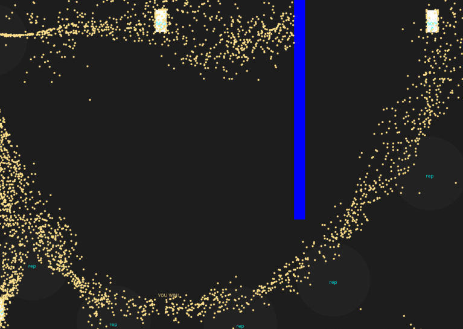

# Momentum

A game created as part of [Global Game Jam 2018](https://globalgamejam.org/2018/games/momentum)

> Momentum is a game about collecting fireflies in jars. Guide the swarm of fireflies around obstacles and towards goals.

# Tech

The game is developed in LUA using the [Love2d framework](https://love2d.org)

# Credits

Rose Oliver - Music

Andrew Grant - Programming

Graham Pentheny - Programming
